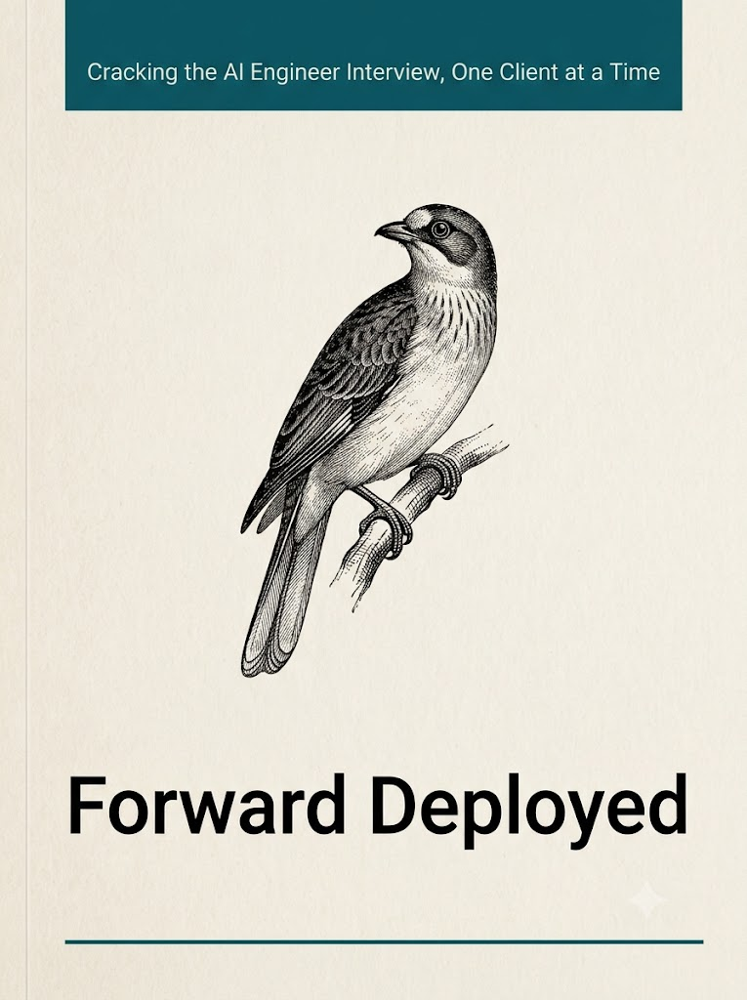

# Forward Deployed

---

Twelve weeks. One law firm in Mumbai. A managing partner who has been burned by AI, a statement of work that commits you to numbers, and a data room full of contracts that matter more than anyone realizes.

Forward deployed AI engineers are hired to walk into situations like this one and make AI work for clients who have every reason to doubt it. The interviews for the role are built the same way: they hand you a messy client situation and watch what you do. This book prepares you by putting you inside one. Every concept, from how a language model predicts text to how you manage a client who wants a promise you cannot make, is taught at the moment the engagement needs it, so that when the interview presents a situation, you recognize it.

---

## Before You Begin

- [How to Read This Book](book/01-how-to-read-this-book.md)
- Prologue — What a Forward Deployed Engineer Is *(not yet written)*
- [The Case — Mehra & Cole LLP](book/02-the-case-mehra-and-cole.md)

## Part I — Build: Making AI Work in the Wild

*Can you make it work?*

- Chapter 1 — How LLMs Actually Work
- Chapter 2 — Context Engineering and Prompting
- Chapter 3 — Retrieval and Enterprise Data
- Chapter 4 — Tools and Agents
- Chapter 5 — Evals
- Chapter 6 — Production in the Client's Environment
- Chapter 7 — The One-Week Prototype

## Part II — Land: Making Them Believe

*Can you make them believe it?*

- Chapter 8 — Discovery
- Chapter 9 — Structured Thinking
- Chapter 10 — Storytelling and Demos
- Chapter 11 — Reporting and Written Communication
- Chapter 12 — Your Personal Operating System
- Chapter 13 — Presence

## Part III — Lead: Making It Stick

*Can it survive without you?*

- Chapter 14 — Managing Up
- Chapter 15 — Managing the Client
- Chapter 16 — Managing Across
- Chapter 17 — Managing Down
- Chapter 18 — When It Breaks

## Epilogue

- The Interview

## Back Matter

- Glossary
- Bibliography
- About the Author
